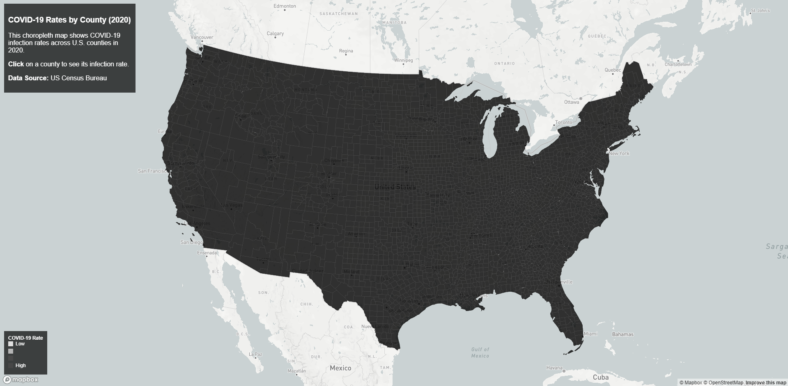
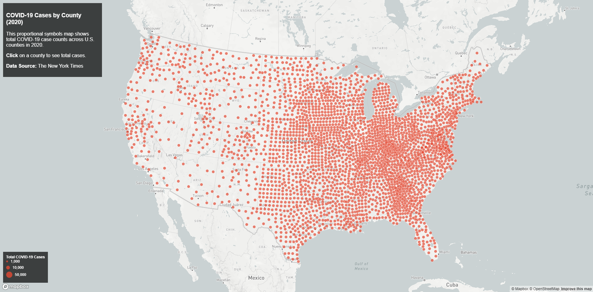

# US COVID-19 Case Rates & Counts (2020) Thematic Web Maps

This lab presents two interactive thematic web maps visualizing COVID-19 data across U.S. counties in 2020. The lab applies cartographic principles such as choropleth mapping, proportional symbol visualization, legends, and interactivity—to communicate spatial patterns in public health data. The maps are built using Mapbox GL JS and county-level data processed into GeoJSON format.

## Maps

Choropleth Map (Case Rates): https://travlee10.github.io/Covid2020_ThematicMap/map1.html

The first map is a choropleth map that visualizes COVID-19 case rates by county. Counties are classified and symbolized using a color scheme that represents the number of cases per thousand residents. Users can click on any county to view a popup displaying the county name and its corresponding COVID-19 case rate.

  

Proportional Symbols Map (Case Counts): https://travlee10.github.io/Covid2020_ThematicMap/map2.html

The second map is a proportional symbols map that represents total COVID-19 case counts by county. Circular symbols are scaled proportionally to the total number of reported cases, allowing users to quickly identify counties with higher case totals. Clicking on a circle opens a popup showing the county name and the total number of COVID-19 cases.

  

## Features
Both maps include interactive and cartographic features. Clickable popups allow users to retrieve county-level information, displaying the county name along with either the COVID-19 case rate or total case count, depending on the map. The choropleth map uses classified color ramps to represent ordered data, while the proportional symbols map scales circle sizes to reflect differences in case counts. Each map includes a custom legend to support interpretation, uses an Albers equal-area projection appropriate for US wide mapping, and is displayed on a carefully selected basemap to ensure the thematic layers stand out clearly.

List:
- Interactive popups
- Click popups
- Proportional symbol scaling
- Choropleth classification
- Custom legends
- Albers projection

## Libraries
- Mapbox GL JS

## Data Sources
COVID-19 case and death data are originally sourced from The New York Times COVID-19 dataset. Population data used to calculate case rates comes from the 2018 American Community Survey (ACS) 5-year estimates. County boundary data is provided by the U.S. Census Bureau. All datasets were processed and converted to GeoJSON format prior to mapping.

List:
- New York Times COVID-19 data
- U.S. Census Bureau
- ACS 2018

## Author
Travis Lee

## Acknowledgments
Completed as part of a web mapping lab for Geog 458 Lab 3.
